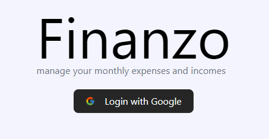

# Finanzo - A financial management tool



# Why Finanzo?

Just as a company needs to take care of their finances, so each individual must take responsibility for their finances
if they want to make some progress in the financial field.

# Features

- Create/Delete yearly report 
- Create/Delete transaction item
- Create/Delete upcoming payment
- List all transactions by month
- Finance analysis

# Tech stack:

T3 stack - https://init.tips/other

### Frontend:

- TailwindCSS
- Next.js
- tRPC
- react hook form
- Chart.js
- Zod
- react-hot-toast

### Backend:

- NextAuth
- tRPC
- Prisma
- PlanetScale MySQL Database

# Env exmaple

```dotenv
DATABASE_URL="mysql://127.0.0.1:3306/finanzo"
NEXTAUTH_SECRET=secret
NEXTAUTH_URL=http://localhost:3000
NODE_ENV=development
GOOGLE_CLIENT_ID=google-client-id
GOOGLE_CLIENT_SECRET=google-sceret
```

# Getting started

### Start Next project

```bash
$ npm install
$ npm run dev
```

### Start Prisma

```bash
$ npx prisma db pull
$ npx prisma generate
```

To push prisma schema to database run :

```bash
$ npx prisma db push
```

To view database tables run :

```bash
$ npx prisma studio
```

### Start database

If you are on a Mac you need to install the CLI first :

```bash
$ brew install planetscale/tap/pscale
```

You need privileges from admin to connect to the database :

```bash
$ pscale connect finanzo
```

# Todo
- [ ] fix month and year problem on slovenian language
- [ ] add tests
- [ ] add details when click on transaction
- [ ] fix login when revisiting site (if already logged in redirect to dashboard)
